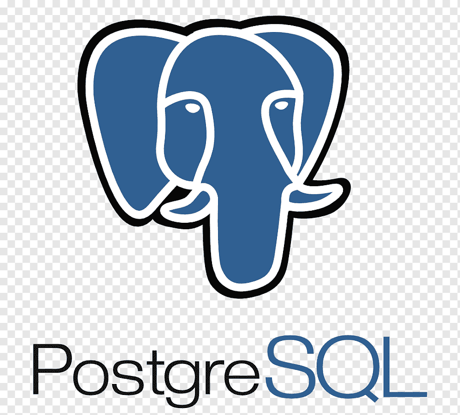

<h1 align="center">:wave: Hi there! I'm Wamaitha</h1>

- ✨ I am a Software Engineer with a BSc in Applied Computer Technology and four years of experience in the Information Technology and Services industry. I am skilled in  Software Development, CI/CD, Containerization, MicroService Orchestration, and Artificial Intelligence. 

   

<h2 align="left" >Favorite Tech</h2>

> Tools of trade
<table align="center">
  <tr>
    <td align="center" width="144">
      
       Ansible
    </td>
    <td align="center" width="144">
      
       Python
    </td>
    <td align="center" width="144">
      
       Redux
    </td>
    <td align="center" width="144">
      
       Docker
    </td>
    <td align="center" width="144">
      
       CICD
    </td>
    <td align="center" width="144">
      
       MongoDB
    </td>
    </tr>
    <tr>
    <td align="center" width="144">
      
       NodeJS
    </td>
    <td align="center" width="144">
      
       PostGres
    </td>
    <td align="center" width="144">
      
       React Query
    </td>
    <td align="center" width="144"> 
      
       React
    </td>
    <td align="center" width="144"> 
      
       Redis
    </td>
    <td align="center" width="144">
      
       Tensor Flow
    </td>
    </tr>  
    
</table>

## ✍️ Recent Technical Articles

- [Building microservices using Terraform, Ansible, Docker, Docker Compose, and Github Actions](https://wamaithanyamu.com/building-microservices-using-terraform-ansible-docker-docker-compose-and-github-actions#heading-tools-used)
- [Secure server login using ssh keys](https://wamaithanyamu.com/secure-server-login-using-ssh-keys)
- [How to publish an npm package](https://wamaithanyamu.com/how-to-publish-an-npm-package)
- [Build a slack bot with the slack machine](https://blog.logrocket.com/slack-bot-slack-machine/)
- [Dealing with outliers in machine learning](https://scanairobi.hashnode.dev/dealing-with-outliers)
- [How to integrate the Mpesa STK push API in NodeJS](https://wamaithanyamu.com/how-to-integrate-the-mpesa-stk-push-api-in-nodejs)
- [Finding prime numbers using the sieve of Eratosthenes](https://wamaithanyamu.com/finding-prime-numbers-in-a-list)

## Contacts

[LinkedIn: https://www.linkedin.com/in/wamaithanyamu](https://www.linkedin.com/in/wamaithanyamu)  
[Email: hello@wamaithanyamu.com](hello@wamaithanyamu.com) 

